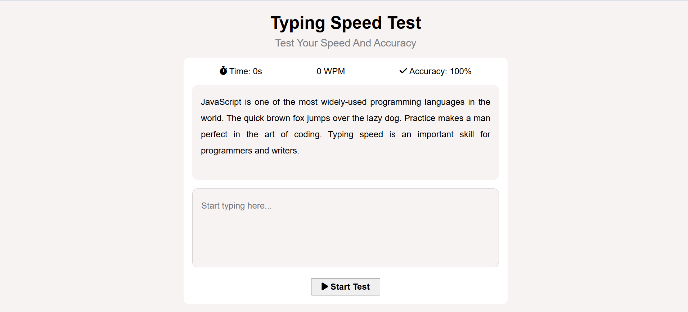

# Typing Speed Test

A simple, interactive web app to test your typing speed and accuracy. Challenge yourself, improve your skills, and track your progress in real time!

## Live Link - https://effervescent-lolly-3bf738.netlify.app/

## Screenshot



## Features

- **Live Timer:** Tracks your typing duration.
- **WPM Calculation:** Displays your words per minute as you type.
- **Accuracy Meter:** Shows your typing accuracy in real time.
- **Random Paragraphs:** Each test uses a randomly generated paragraph.
- **Start/Stop Button:** Easy to begin a new test.
- **Responsive Design:** Works on desktop and mobile devices.

## Technologies Used

- **HTML5** – Structure and layout
- **CSS3** – Styling and responsive design
- **JavaScript** – Typing logic, timer, accuracy, and WPM calculations
- **FontAwesome** – Icons for UI elements

## Getting Started

1. **Clone the repository:**
	```sh
	git clone <your-repo-url>
	cd "Typing Speed Test"
	```

2. **Open the app:**
	- Simply open `index.html` in your browser.

> No build steps or package installation required. All dependencies are loaded via CDN or local files.

## Project Structure

- `index.html` – Main HTML file
- `style.css` – App styling
- `app.js` – Typing logic and interactivity
- `assests/` – Images/icons for UI

## Customization

- **Change Paragraphs:** Edit the `sentenceFragments` array in `app.js` to add or modify test sentences.
- **Styling:** Update `style.css` for custom colors, fonts, or layouts.
- **Icons:** Replace or add icons in the `assests/` folder.

## License

This project is open source and free to use for personal and educational purposes.

---

_Made with ❤️ by Akshansh for fun learning!_
